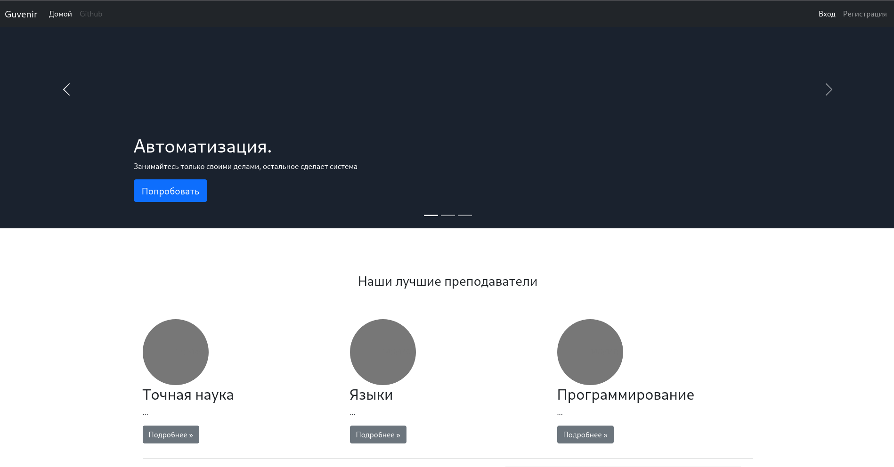

## Установка
```
git clone <repo>.git
cd <repo>/server
cp .env.bak .env
python3 -m venv venv
. venv/bin/activate
pip install -r requirements.txt
```

## Инициализация
```
make init
```

## Запуск 
```
make run
```
### Скрипшоты

